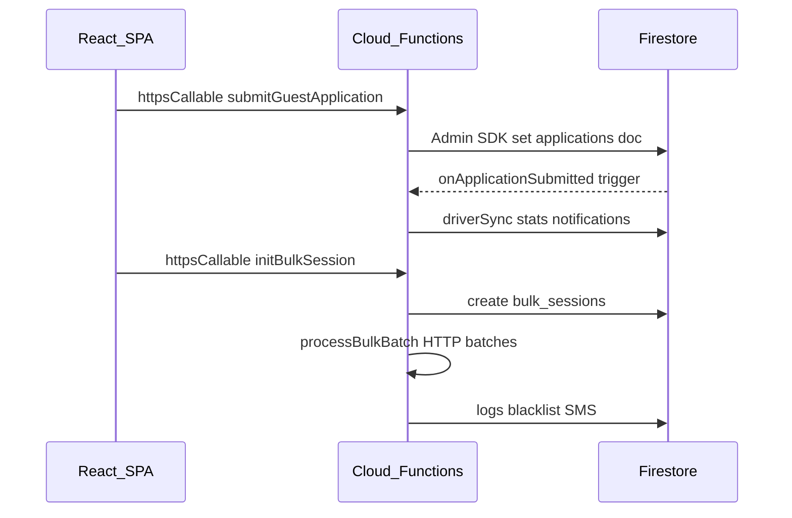

# Cloud Functions ↔ Frontend Callable Map

Maps each **`httpsCallable`** export in [`functions/index.js`](../functions/index.js) to React caller sites under `src/`. Generated by static search (`httpsCallable(functions, 'name')` and `getFunctions()` variants).

**CI contract:** [`scripts/check-callable-contract.mjs`](../scripts/check-callable-contract.mjs) verifies every `httpsCallable(functions, …)` name is exported from `functions/index.js`.

---

## Callable exports with SPA callers

| Callable | Caller file(s) | Typical use |
|----------|----------------|-------------|
| `addPhoneLine` | [`AddLineModal.jsx`](../src/features/super-admin/components/integrations/AddLineModal.jsx) | Add SMS line to company inventory |
| `backfillAllSmsSentPhones` | [`useSystemHealth.js`](../src/features/super-admin/hooks/useSystemHealth.js) | Admin: backfill SMS sent phones (all companies) |
| `backfillAllStats` | [`StatsBackfillPanel.jsx`](../src/features/super-admin/components/StatsBackfillPanel.jsx) | Admin: stats backfill all tenants |
| `backfillCompanyStats` | [`StatsBackfillPanel.jsx`](../src/features/super-admin/components/StatsBackfillPanel.jsx) | Admin: stats backfill one company |
| `backfillEmployerFields` | [`BackfillEmployersButton.jsx`](../src/features/super-admin/components/BackfillEmployersButton.jsx), [`SuperAdminDashboard.jsx`](../src/features/super-admin/components/SuperAdminDashboard.jsx) | Migrate employer fields on applications |
| `backfillPublicProfiles` | [`useSystemHealth.js`](../src/features/super-admin/hooks/useSystemHealth.js) | Sync all companies → `public_profiles` |
| `cancelBulkSession` | [`CampaignDetails.jsx`](../src/features/campaigns/components/CampaignDetails.jsx) | Stop bulk campaign |
| `checkImportPhones` | [`useCampaignTargeting.js`](../src/features/campaigns/hooks/useCampaignTargeting.js) | CSV import phone dedup check |
| `connectFacebookPage` | [`IntegrationsTab.jsx`](../src/features/settings/components/IntegrationsTab.jsx) | Facebook Lead Ads OAuth |
| `createPortalUser` | [`CreateView.jsx`](../src/features/super-admin/components/CreateView.jsx), [`TeamManagementTab.jsx`](../src/features/settings/components/TeamManagementTab.jsx), [`useSystemHealth.js`](../src/features/super-admin/hooks/useSystemHealth.js) | Provision HR/recruiter/company user |
| `createPostApplicationSigningRequest` | [`PublicApplyHandler.jsx`](../src/features/driver-app/components/application/PublicApplyHandler.jsx) | Post-submit e-doc envelope |
| `createChangeReview` | [`useApplicationChanges.js`](../src/features/applications/hooks/useApplicationChanges.js) | Mint a token link for the driver to review company edits |
| `deleteApplication` | [`useApplicationDelete.js`](../src/features/applications/hooks/useApplicationDelete.js) | Company-admin hard delete of an application/lead (cascade + storage) |
| `proposeApplicationChanges` | [`useApplicationChanges.js`](../src/features/applications/hooks/useApplicationChanges.js) | Company edits saved as pending driver-approval changes |
| `deleteCompany` | [`DeleteCompanyModal.jsx`](../src/features/super-admin/components/modals/DeleteCompanyModal.jsx) | Remove tenant |
| `deletePortalUser` | [`DeleteUserModal.jsx`](../src/features/super-admin/components/modals/DeleteUserModal.jsx), [`ManageTeamModal.jsx`](../src/shared/components/modals/ManageTeamModal.jsx), [`EditUserNameForm.jsx`](../src/features/super-admin/components/users/EditUserNameForm.jsx) | Delete portal account |
| `deleteSandboxApplication` | [`SandboxActionPanel.jsx`](../src/features/sandbox/SandboxActionPanel.jsx) | Sandbox cleanup |
| `getEmailSettingsMeta` | [`EmailSettingsTab.jsx`](../src/features/settings/components/EmailSettingsTab.jsx) | Load SMTP meta (no password) |
| `getFilteredLeadsPage` | [`VirtualLeadList.jsx`](../src/features/campaigns/components/VirtualLeadList.jsx) | Paginated campaign audience |
| `getFilterCount` | [`useCampaignTargeting.js`](../src/features/campaigns/hooks/useCampaignTargeting.js) | Audience size preview |
| `getChangeReview` | [`ReviewChangePortal.jsx`](../src/features/driver-changes/ReviewChangePortal.jsx) | Driver loads company-proposed changes (before/after) |
| `getPublicEnvelope` | [`SigningRoom.jsx`](../src/features/signing/SigningRoom.jsx) | Public e-sign load |
| `getSignedApplicationFileUrl` | [`useAppFetch.js`](../src/features/applications/hooks/useAppFetch.js) | Re-sign guest-uploaded application files (CDL etc.) for company dossier view |
| `getSignedGuestUploadUrl` | [`PublicApplyHandler.jsx`](../src/features/driver-app/components/application/PublicApplyHandler.jsx) | Guest file read URL |
| `getSignedPevUrl` | [`PEVTab.jsx`](../src/features/company-admin/components/tabs/PEVTab.jsx) | Signed URL for PEV PDF |
| `getSignedUploadUrl` | [`PublicApplyHandler.jsx`](../src/features/driver-app/components/application/PublicApplyHandler.jsx) | Auth/guest upload URL |
| `getSigningLink` | [`EnvelopeHistory.jsx`](../src/features/signing/components/EnvelopeHistory.jsx) | Resolve link with secret token |
| `getVerificationRequest` | [`VerificationPortal.jsx`](../src/features/verification/VerificationPortal.jsx) | PEV portal load |
| `initBulkSession` | [`LaunchPad.jsx`](../src/features/campaigns/components/LaunchPad.jsx) | Start bulk SMS/email session |
| `listSandboxTenantCompanies` | [`SandboxActionPanel.jsx`](../src/features/sandbox/SandboxActionPanel.jsx) | List sandbox tenants |
| `parseCdlWithGroq` | [`PublicApplyHandler.jsx`](../src/features/driver-app/components/application/PublicApplyHandler.jsx) | CDL image OCR |
| `pauseBulkSession` | [`CampaignDetails.jsx`](../src/features/campaigns/components/CampaignDetails.jsx) | Pause campaign |
| `removePhoneLine` | [`LineManager.jsx`](../src/features/super-admin/components/integrations/LineManager.jsx) | Remove SMS line |
| `resumeBulkSession` | [`CampaignDetails.jsx`](../src/features/campaigns/components/CampaignDetails.jsx) | Resume campaign |
| `retryFailedAttempts` | [`CampaignDetails.jsx`](../src/features/campaigns/components/CampaignDetails.jsx), [`DetailedReportModal.jsx`](../src/features/campaigns/components/DetailedReportModal.jsx) | Retry failed bulk sends |
| `runMigration` | [`useSystemHealth.js`](../src/features/super-admin/hooks/useSystemHealth.js) | Data migration tool |
| `runSecurityAudit` | [`useSystemHealth.js`](../src/features/super-admin/hooks/useSystemHealth.js) | Security audit |
| `saveEmailSettings` | [`EmailSettingsTab.jsx`](../src/features/settings/components/EmailSettingsTab.jsx) | Persist SMTP config |
| `saveIntegrationConfig` | [`IntegrationManager.jsx`](../src/features/super-admin/components/integrations/IntegrationManager.jsx) | Save encrypted SMS credentials |
| `sendAutomatedEmail` | [`useCallOutcome.js`](../src/shared/hooks/useCallOutcome.js) | Template email from dossier/call flow |
| `sendSMS` | [`DocumentsManager.jsx`](../src/features/company-admin/views/DocumentsManager.jsx), [`EnvelopeCreator.jsx`](../src/features/signing/EnvelopeCreator.jsx) | Outbound SMS |
| `sendTestSMS` | [`SMSDiagnosticModal.jsx`](../src/features/settings/components/SMSDiagnosticModal.jsx), [`IntegrationManager.jsx`](../src/features/super-admin/components/integrations/IntegrationManager.jsx) | SMS connectivity test |
| `sendVerificationRequest` | [`PEVTab.jsx`](../src/features/company-admin/components/tabs/PEVTab.jsx) | Start PEV request |
| `submitChangeResolution` | [`ReviewChangePortal.jsx`](../src/features/driver-changes/ReviewChangePortal.jsx) | Driver approve/reject/edit company changes |
| `submitGuestApplication` | [`PublicApplyHandler.jsx`](../src/features/driver-app/components/application/PublicApplyHandler.jsx), [`useSubmissionQueue.js`](../src/hooks/useSubmissionQueue.js) | Guest/auth application submit |
| `submitPublicEnvelope` | [`SigningRoom.jsx`](../src/features/signing/SigningRoom.jsx) | Complete public signature |
| `submitVerificationResponse` | [`VerificationPortal.jsx`](../src/features/verification/VerificationPortal.jsx) | Employer PEV response |
| `syncSystemStructure` | [`useSystemHealth.js`](../src/features/super-admin/hooks/useSystemHealth.js) | Repair system structure |
| `testEmailConnection` | [`EmailSettingsTab.jsx`](../src/features/settings/components/EmailSettingsTab.jsx) | SMTP test |
| `testLineConnection` | [`AddLineModal.jsx`](../src/features/super-admin/components/integrations/AddLineModal.jsx) | Test new SMS line |
| `transferSandboxApplication` | [`SandboxActionPanel.jsx`](../src/features/sandbox/SandboxActionPanel.jsx) | Move sandbox app to prod tenant |
| `updatePortalUser` | [`userService.js`](../src/features/auth/services/userService.js) | Update portal user / claims |
| `verifyLineConnection` | [`NumberAssignmentManager.jsx`](../src/features/settings/components/NumberAssignmentManager.jsx) | Verify recruiter line assignment |
| `verifySmsConfig` | [`SMSDiagnosticModal.jsx`](../src/features/settings/components/SMSDiagnosticModal.jsx) | Verify company SMS config |

---

## Callable exports with no SPA caller

These are exported and may be used by **scripts**, **future UI**, **legacy clients**, or **internal workers**:

| Callable | Notes |
|----------|-------|
| `backfillSmsSentPhones` | Per-company SMS phone backfill; only `backfillAllSmsSentPhones` is wired in UI |
| `executeReactivationBatch` | SMS reactivation batch; referenced in bulk session comments, no `src/` caller |
| `migrateEmailSettings` | One-time migration; invoke callable manually (ops) |
| `reconcileCompanyDashboardStats` | KPI reconciliation callable ([`dashboardStatsRollup.js`](../functions/dashboardStatsRollup.js)) |
| `updateBulkSessionStatus` | Legacy compat; pause/resume/cancel now also use direct Firestore writes per [`functions/index.js`](../functions/index.js) comment |

---

## Not `httpsCallable` (do not call from Firebase JS SDK)

| Export | Type | Invocation |
|--------|------|------------|
| `processBulkBatch` | HTTP `onRequest` | Cloud Tasks → POST with `X-SafeHaul-Internal-Auth` |
| `facebookWebhook`, `facebookWebhookV1` | HTTP | Facebook Lead Ads |
| `trackVerificationOpen` | HTTP | 1×1 tracking pixel |
| `onApplicationSubmitted`, `onLeadWrittenDashboardRollup`, … | Firestore triggers | Automatic on writes |
| `enforceFeatureSchedules`, `cleanupOrphanedSignatures`, `processVerificationReminders` | Scheduled | Cloud Scheduler |
| `sealDocument`, `notifySigner`, `notifySignerSMS`, `handleOptOut`, … | Triggers | Automatic |

---

## Flow diagram (common paths)

---

## Maintenance

When adding a callable:

1. Export in [`functions/index.js`](../functions/index.js).
2. Call from SPA with `httpsCallable(functions, 'exactExportName')`.
3. Run `node scripts/check-callable-contract.mjs` (also runs in CI).
