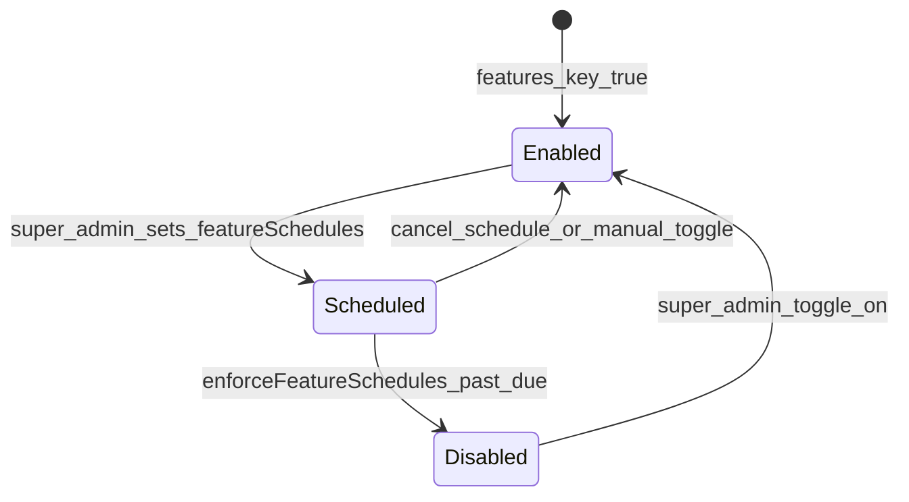

# Company Feature Flags (`features.*` / `featureSchedules.*`)

Per-tenant feature toggles live on **`companies/{companyId}`** as two parallel maps:

| Field | Type | Meaning |
|-------|------|---------|
| `features` | `Record<string, boolean>` | Current on/off state. **Enabled only when value is strictly `true`.** |
| `featureSchedules` | `Record<string, string \| null>` | ISO-8601 datetime when a feature should auto-disable |

Super admins manage both via [`FeaturesView.jsx`](../src/features/super-admin/components/FeaturesView.jsx). Company users see scheduled shutdown warnings via [`FeatureDeactivationWarning.jsx`](../src/features/company-admin/components/FeatureDeactivationWarning.jsx).

---

## Canonical feature keys

Defined in `ALL_FEATURES` in [`FeaturesView.jsx`](../src/features/super-admin/components/FeaturesView.jsx):

| Key | Label (admin UI) | Enforced in product |
|-----|------------------|---------------------|
| `searchDB` | Search Drivers | Sidebar (`featureFlag`), [`SearchDriversPage.jsx`](../src/features/company-admin/views/SearchDriversPage.jsx) requires `=== true`, dashboard quick link |
| `driverApp` | Driver Application | **Super-admin toggle only** — no `src/` gate found on `/apply/:slug` or driver wizard |
| `pev` | PEV | [`PEVTab.jsx`](../src/features/company-admin/components/tabs/PEVTab.jsx) blocks when `=== false` |
| `campaignsEnabled` | Campaigns | Sidebar; [`CampaignsDashboard.jsx`](../src/features/campaigns/CampaignsDashboard.jsx) uses `!== false` (default on) |
| `eDocs` | E-Docs | Sidebar; [`DocumentsManager.jsx`](../src/features/company-admin/views/DocumentsManager.jsx) when `=== false` |
| `importLeads` | Import Leads | Sidebar (admin); [`ImportLeadsPage.jsx`](../src/features/company-admin/views/ImportLeadsPage.jsx) when `=== false` |
| `callTracking` | Call Tracking | [`CompanySettings.jsx`](../src/features/settings/components/CompanySettings.jsx) tab hidden when `=== false` |

Routes without a `featureFlag` in [`companyRouteManifest.js`](../src/app/routes/companyRouteManifest.js) (dashboard, applications, leads, pipeline, quick-add, profile, settings) are **always visible** to company team regardless of `features`.

---

## How enforcement works

### 1. Sidebar visibility

[`CompanySidebar.jsx`](../src/features/company-admin/layout/CompanySidebar.jsx):

```javascript
if (nav.featureFlag && featureFlags[nav.featureFlag] === false) return false;
```

- Missing key or `undefined` → nav item **shown**
- Explicit `false` → nav item **hidden**

Manifest flags: `searchDB`, `campaignsEnabled`, `eDocs`, `importLeads` ([`companyRouteManifest.js`](../src/app/routes/companyRouteManifest.js)).

### 2. Page-level guards

Stricter checks on direct URL access:

| Page | Condition to allow |
|------|-------------------|
| Search Drivers | `features.searchDB === true` |
| Import Leads | `features.importLeads !== false` (implicit default on) |
| E-Docs | `features.eDocs !== false` |
| Campaigns | `features.campaignsEnabled !== false` |
| PEV tab | `features.pev !== false` |
| Call tracking settings | `features.callTracking !== false` |

**Asymmetry:** `searchDB` is opt-in (`=== true`); most others opt-out (`=== false` disables).

### 3. Public / driver surfaces

- `public_profiles` sync **strips** `features` and `featureSchedules` ([`buildPublicProfileDto`](../functions/companyAdmin.js) / tests in `publicProfileDto.test.js`).
- Guest apply and authenticated driver routes are **not** gated by `features.driverApp` in frontend code today.

---

## Super admin operations

### Manual toggle

`FeaturesView.toggleFeature`:

- Sets `features.{key}` to `!currentValue`
- Clears `featureSchedules.{key}` to `null`

### Schedule deactivation

`handleScheduleDeactivation`:

- Sets `featureSchedules.{key}` to future ISO datetime
- Does **not** change `features.{key}` until schedule fires

User must pick date + time; past times rejected.

### Cancel schedule

Sets `featureSchedules.{key}`: `null`.

### Bulk enable/disable

`handleBulkAction` sets `features.{key}` for all companies (batch writes, 400 per batch). Does not bulk-update schedules.

### Alert analytics

`companies/{companyId}/feature_alerts` stores per-user `views`, `dismisses`, `salesClicks` for scheduled deactivation modals. Rules: team read/write ([`firestore.rules`](../src/firestore.rules)).

---

## Scheduled enforcement (backend)

[`functions/featureScheduler.js`](../functions/featureScheduler.js) — `enforceFeatureSchedules`:

- **Schedule:** every 15 minutes (`us-central1`)
- Scans **all** `companies` documents
- For each `featureSchedules.{key}` where datetime `<= now`:
  - Sets `features.{key}` → `false`
  - Sets `featureSchedules.{key}` → `null`

No notification email; UI warning is client-driven before the date.



---

## Company user warning modal

[`FeatureDeactivationWarning.jsx`](../src/features/company-admin/components/FeatureDeactivationWarning.jsx):

- Runs only **7:00–16:00 America/Chicago**
- Shows if any `featureSchedules.*` is still in the **future**
- At most once per 2 hours per company (`localStorage` key `feature_warnings_shown_{companyId}`)
- Lists feature keys + scheduled datetime
- Logs interactions to `feature_alerts`
- “Contact Sales” opens Telegram link

Mounted from company shell (see `CompanyAppShell` / dashboard layout).

---

## Data shape example

```json
{
  "companyName": "Acme Trucking",
  "features": {
    "searchDB": true,
    "campaignsEnabled": true,
    "eDocs": true,
    "pev": true,
    "importLeads": true,
    "callTracking": true,
    "driverApp": true
  },
  "featureSchedules": {
    "campaignsEnabled": "2026-06-01T04:00:00.000Z"
  }
}
```

After scheduler runs past June 1:

```json
{
  "features": { "campaignsEnabled": false, ... },
  "featureSchedules": { "campaignsEnabled": null }
}
```

---

## Related files

| File | Role |
|------|------|
| [`FeaturesView.jsx`](../src/features/super-admin/components/FeaturesView.jsx) | Admin matrix UI |
| [`featureScheduler.js`](../functions/featureScheduler.js) | Auto-disable job |
| [`companyRouteManifest.js`](../src/app/routes/companyRouteManifest.js) | Nav `featureFlag` keys |
| [`CompanySidebar.jsx`](../src/features/company-admin/layout/CompanySidebar.jsx) | Nav filtering |
| [`FeatureDeactivationWarning.jsx`](../src/features/company-admin/components/FeatureDeactivationWarning.jsx) | Pre-shutdown UX |
| [`DataContext.jsx`](../src/context/DataContext.jsx) | Loads `currentCompanyProfile` including flags |

---

## Gaps / implementation notes

1. **`driverApp`** — toggled in super admin but not enforced on public apply or driver portal; treat as operational/metadata unless server-side checks are added.
2. **Default-on vs default-off** — `searchDB` requires explicit `true`; other flags disable only on explicit `false`.
3. **Scale** — scheduler loads all companies each run; acceptable at current scale per code comment; would need indexing if tenant count grows large.
