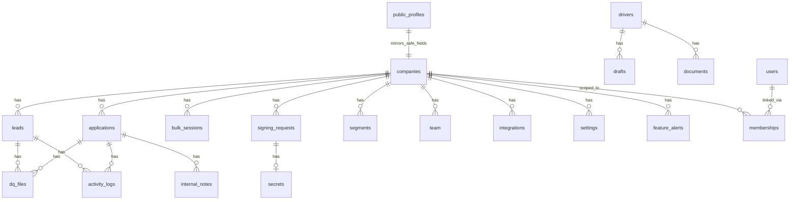

# Firestore Data Model

Derived from [`src/firestore.rules`](../src/firestore.rules) (deployed with hosting) and backend usage in `functions/`. This document reflects **security-rule coverage** and **observed collection paths** in code—not an exhaustive audit of every field on every document.

**Legend**

| Access | Meaning |
|--------|---------|
| **public** | Unauthenticated read allowed |
| **team** | `isCompanyTeam(companyId)` — `company_admin`, `hr_user`, `recruiter`, or super admin |
| **admin** | `isCompanyAdmin(companyId)` or super admin |
| **owner** | Document owner (`request.auth.uid`) |
| **server** | No client rule match → default **deny**; Cloud Functions use Admin SDK |
| **super** | `isSuperAdmin()` only |

---

## Entity relationship (high level)

---

## Top-level collections

| Collection | Document ID | Client access (summary) | Purpose |
|------------|-------------|-------------------------|---------|
| `companies` | `companyId` | **get:** team or super · **list:** super only · **create/delete:** super · **update:** admin+ | Tenant root: branding, `features`, `featureSchedules`, `applicationConfig`, quotas, etc. |
| `public_profiles` | `companyId` | **read:** public · **write:** server (`syncPublicProfile` trigger) | Sanitized mirror for `/apply/:slug` (no revenue/internal fields) |
| `drivers` | `driverId` (= Auth uid) | **get:** owner, super, or any staff · **list:** owner or super only · **write:** owner or super | Master driver profile |
| `users` | `userId` | **read:** owner, super, staff · **create:** self · **update:** owner (no role/companyId) or super | HR/admin portal user profile |
| `memberships` | auto | **read:** self, super, company admin of tenant · **write:** super or company admin | Links `userId` ↔ `companyId` + role |
| `notifications` | auto | **read/update/delete:** recipient · **create:** denied (server-only) | Per-user inbox |
| `verification_requests` | token | **read:** super only · **write:** denied | PEV; all portal access via callables |
| `verification_requests/{token}/responses` | `responseId` | same as parent | PEV responses |
| `analytics` | `docId` | **read:** super · **write:** denied | Platform analytics |
| `system_settings` | `settingId` | **read:** staff or super · **write:** super | Global settings |
| `recruiter_links` | `code` | **read:** public · **write:** staff/super | Recruiter attribution URLs |
| `job_posts` | `postId` | **read:** public · **write:** company team for own `companyId` | Legacy (unused; internal job board removed) |

### Server-only top-level (no rules → client denied)

Used by Cloud Functions with Admin SDK:

| Collection | Purpose |
|------------|---------|
| `blacklist/{phone}` | Global SMS opt-out |
| `rate_limits/{key}` | Token-bucket rate limiting |
| `processing_status/{id}` | Trigger idempotency (e.g. `app_{companyId}_{appId}`) |
| `orphaned_signature_cleanup` | Digital sealing maintenance |
| `environment_audit_log/{id}` | Super Admin Environment & Integrations vault audit trail. Written only by the vault callables; `src/firestore.rules` denies every client read and write, **including Super Admins**, so it cannot be forged or read around the callable. Fields: `actorUid`, `actorEmail`, `action`, `result`, `entryId`, `key`, `integration`, `scope`, `companyId`, `source`, `category`, `sensitivity`, `availability`, `reason`, `valueLength`, `timestamp`. It never stores a plaintext value, ciphertext, a partial value or a token fragment — see [`functions/environmentVault/audit.js`](../functions/environmentVault/audit.js). |

---

## `companies/{companyId}` subcollections

| Subcollection | Access (summary) | Notes |
|---------------|------------------|-------|
| `templates/{id}` | read: team · write: admin | Hiring offer/form templates |
| `message_templates/{id}` | read: team · write: admin | Campaign message templates |
| `bulk_sessions/{id}` | read/write: team | Bulk SMS/email sessions |
| `bulk_sessions/{id}/logs/{id}` | read: team | Per-message send logs |
| `campaign_drafts/{id}` | read/write: team | Campaign wizard persistence |
| `segments/{id}` | read: team · write: admin | Smart segments |
| `segments/{id}/members/{id}` | read: team · write: admin | Segment membership |
| `stats_daily/{dateId}` | read: team | Aggregated daily stats (server-written) |
| `internal_stats/{docId}` | read: team · write: **denied** | Dashboard KPI rollups (server-only writes) |
| `notifications/{id}` | read: team · create: admin · update: team · delete: admin | Company-scoped notifications |
| `feature_alerts/{id}` | read/write: team or super | Scheduled deactivation warning analytics |
| `system_settings/email_config` | read/write: admin | SMTP credentials (sensitive) |
| `settings/{docId}` | read: team · write: admin | Custom questions, ATS SMS templates, etc. |
| `signing_requests/{id}` | read: team, recipient, super · create: team · update: team or recipient (limited fields) · delete: admin | E-sign envelopes |
| `signing_requests/{id}/secrets/{id}` | create: team · read/update/delete: **denied** | `accessToken`; Functions only after create |
| `applications/{applicationId}` | see below | Core applicant record |
| `leads/{leadId}` | team read/write with `companyId` immutability + ATS status enums | CRM leads |
| `team/{userId}` | read: team · write: admin | Company roster metadata |
| `integrations/{integrationId}` | read/update: admin · create/delete: super | Encrypted SMS provider config |

### Server-only company subcollections (no rules)

| Path | Purpose |
|------|---------|
| `companies/{id}/blacklist/{phone}` | Company opt-out list |
| `companies/{id}/inbound_messages/{id}` | Inbound SMS (STOP handling trigger) |

---

## `applications/{applicationId}` (under company)

| Operation | Who |
|-----------|-----|
| **create** | Driver/guest with deterministic ID (`applicationId == applicantId`); or company team (manual entry) |
| **read** | Team, applicant/owner driver, email-verified owner, super |
| **update** | Team (ATS status in allowlist); driver self-update on **allowlisted fields** only; super |
| **delete** | Admin or super |

**Subcollections**

| Subcollection | Access |
|---------------|--------|
| `dq_files`, `general_documents` | read: team, super, or owner fields on doc · write: team, super |
| `internal_notes`, `activity_logs`, `activities` | read/write: team, super |

**Deterministic IDs:** Client sets doc ID = truncated hash of `companyId:email:phone` (see [`src/lib/applicationId.js`](../src/lib/applicationId.js)). Primary guest path uses `submitGuestApplication` (Admin SDK).

---

## `leads/{leadId}` (under company)

| Operation | Who |
|-----------|-----|
| **create/update** | Team or super; `companyId` must match path and stay immutable |
| **delete** | Team or super |

Same activity/DQ/note subcollections as applications (team/super).

---

## `drivers/{driverId}` subcollections

| Subcollection | Access |
|---------------|--------|
| `drafts`, `saved_jobs` (legacy/unused), `documents` | owner or super |

---

## Collection group queries

Rules at end of `firestore.rules` allow cross-tenant queries when scoped by claims:

| Group | Read allowed when |
|-------|-------------------|
| `{path=**}/applications/{appId}` | super; applicant/owner; team for `resource.data.companyId` |
| `{path=**}/leads/{leadId}` | super; team for company; lead `userId` == auth uid |
| `{path=**}/activity_logs/{id}` | super; team if `companyId` is string on doc |
| `{path=**}/signing_requests/{id}` | super; recipient; team for `companyId` |

---

## RBAC helpers (rules)

| Helper | Grants |
|--------|--------|
| `isSuperAdmin()` | `globalRole == 'super_admin'` (token or nested legacy) |
| `isCompanyAdmin(companyId)` | super or `roles[companyId] == 'company_admin'` |
| `isCompanyTeam(companyId)` | super, admin, or `hr_user` / `recruiter` |
| `isStaff()` | any user with non-empty `roles` map |

Custom claims are set via `onMembershipWrite` and HR admin callables ([`functions/hrAdmin.js`](../functions/hrAdmin.js)).

---

## Related files

| File | Role |
|------|------|
| [`firestore.indexes.json`](../firestore.indexes.json) | Composite indexes |
| [`src/storage.rules`](../src/storage.rules) | Storage paths (`guest_uploads/`, company assets) |
| [`functions/companyAdmin.js`](../functions/companyAdmin.js) | `buildPublicProfileDto` — fields synced to `public_profiles` |

---

## `public_profiles` field whitelist

Synced from `companies` on write (not readable from full company doc by guests):

- `companyName`, `appSlug`, `logoUrl`, `brandColor`
- `applicationConfig` (subset of keys in `PUBLIC_APPLICATION_CONFIG_KEYS`)
- `customQuestions`
- `updatedAt`

`features` and `featureSchedules` are **not** exposed on public profiles.
